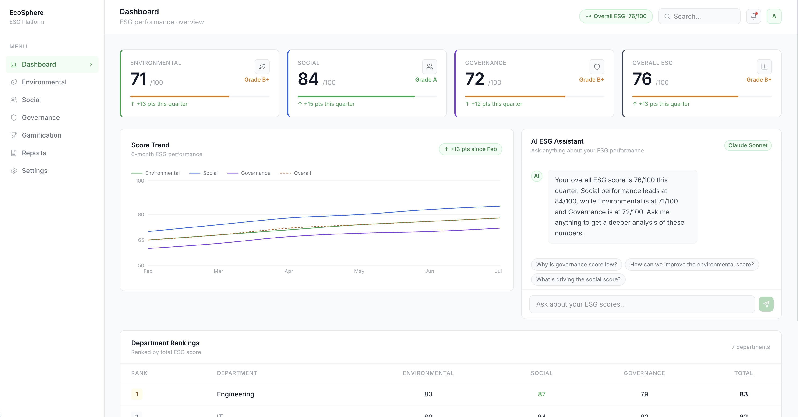
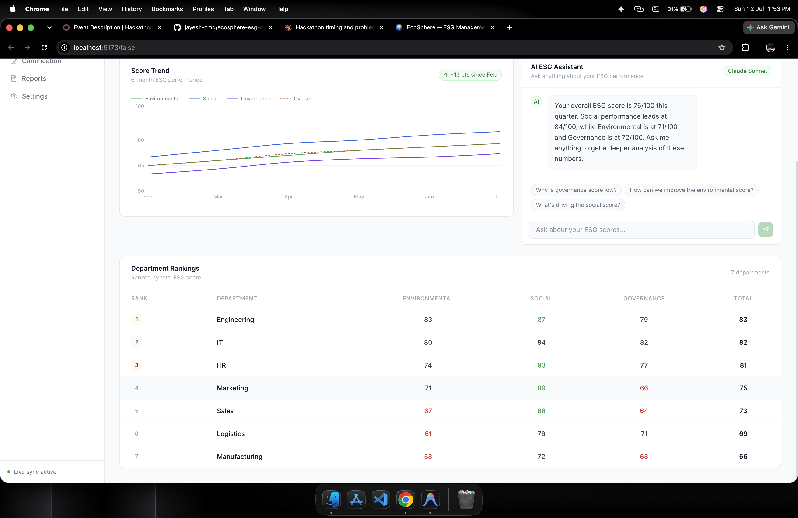
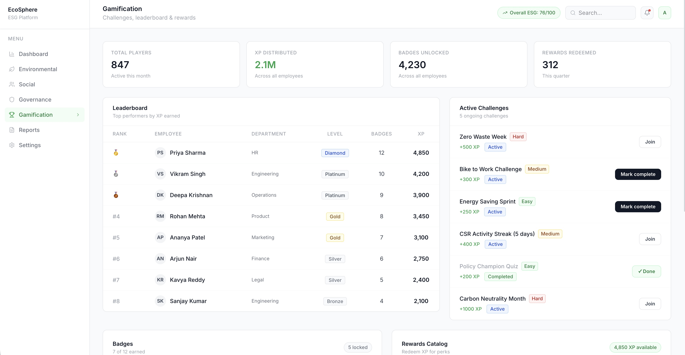

# EcoSphere — ESG Management Platform

## Problem
Tracking, managing, and reporting on ESG (Environmental, Social, and Governance) metrics is traditionally fragmented, manual, and prone to greenwashing. Companies struggle to get a unified, real-time view of their sustainability goals and lack the automated insights necessary to actively improve their ESG scores across different departments.

## What we built
- **Environmental Module**: Track carbon transactions, offsets, and monitor progress on sustainability goals. Includes automated anomaly detection for unusual emission spikes.
- **Social Module**: Manage CSR activities, track employee participation, and monitor community impact.
- **Governance Module**: Audit compliance issues, track policy acknowledgements, and manage organizational risk metrics.
- **Gamification Module**: Engage employees with a department leaderboard, active challenges, unlockable badges, and a rewards catalog for eco-friendly actions.
- **Settings & Reports**: Configure dynamic ESG score weighting, toggle automation preferences, and use a custom report builder to export filtered data (PDF/CSV/Excel).
- **Notifications**: Real-time dropdown alerts for compliance issues, badge unlocks, and CSR approvals.
- **AI ESG Assistant**: A conversational AI that acts as an expert analyst on your live data.

## Key Differentiator
Claude-powered AI ESG Assistant that answers natural language questions about live company ESG data, plus automated anomaly/greenwashing detection that catches unusual emission spikes in real-time.

## Tech Stack
- **Frontend**: React (Vite)
- **State Management**: React Context API
- **AI Integration**: Anthropic Claude API (`claude-sonnet-4-6`)
- **Styling**: Vanilla CSS / Minimalist SaaS Aesthetic
- **Icons**: Lucide React

## How to run

1. Install the project dependencies:
   ```bash
   npm install
   ```

2. Create a `.env` file in the root directory and add your Anthropic API key:
   ```env
   VITE_ANTHROPIC_API_KEY=your_claude_api_key_here
   ```

3. Start the local development server:
   ```bash
   npm run dev
   ```

## Screenshots

*(Make sure to save the screenshots you provided into a `screenshots` folder in your repository to display them here!)*

### Dashboard & AI Assistant


### Environmental Tracking & Anomaly Detection


### Department Rankings & Score Trends

